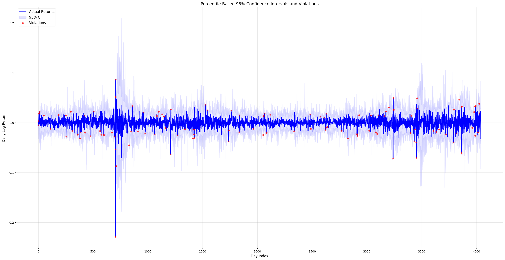

# GARCH Models for SP500 Daily Returns  

This repository contains a university group project, completed during my Master's in Quantitative Finance at USI Lugano, that examines the suitability of the GARCH(1,1) model for SP500 daily returns.  
> **Note:** The code is being updated to include calculations for Value at Risk (VAR), Expected Shortfall (ES), and Monte Carlo simulations.

## Overview

The analysis explores whether the GARCH(1,1) model effectively captures the dynamics of SP500 returns, using both normal and Student's t-distributions. Key steps include:

- **Data Collection:** 15 years of daily SP500 data downloaded from Yahoo Finance.
- **Model Implementation:** A custom GARCH(1,1) model built without relying on built-in Python functions.
- **Confidence Interval Simulation:** Using estimated parameters, 95% confidence intervals are simulated for a 30-day prediction horizon.
- **Validation:** The frequency of actual returns violating these intervals is evaluated and visualized.

## Files

**`Garch.ipynb`** Contains the full analysis, including data processing, GARCH model implementation, parameter estimation, and validation steps.

**`Report.pdf`** A comprehensive summary of the project, covering objectives, theoretical background, results, and conclusions.

## Results Example

Below is an example of the results. The image shows confidence intervals and violations for the T-GARCH model. For further details and insights, please refer to the report and notebooks.

## User Guide

A detailed user guide is available in `Report.pdf` for more information.. The process is anyway very straightforward.

1. **Setup**:
   - Ensure Python is installed along with a Jupyter-compatible environment (e.g., VS Code, Anaconda).

2. **Execution**:
   - Open the `Garch.ipynb` notebook and select "Run All" to execute the analysis.
   - The S&P 500 data is downloaded automatically from Yahoo Finance during execution, so no manual data preparation is needed.
   - Note that **internet connection** is required to fetch data from Yahoo Finance.

3. **Packages**:
   - All required libraries are included in the notebook with `pip install` commands.
   - If any packages are missing, install them by removing the `#` at the beginning of the respective `pip install` lines in the notebook and running the cell.

## Contacts
For any clarifications, questions, or to report issues with the code, feel free to reach out via email at alessandro.dodon@usi.ch. You can also find my LinkedIn link in my GitHub bio.

